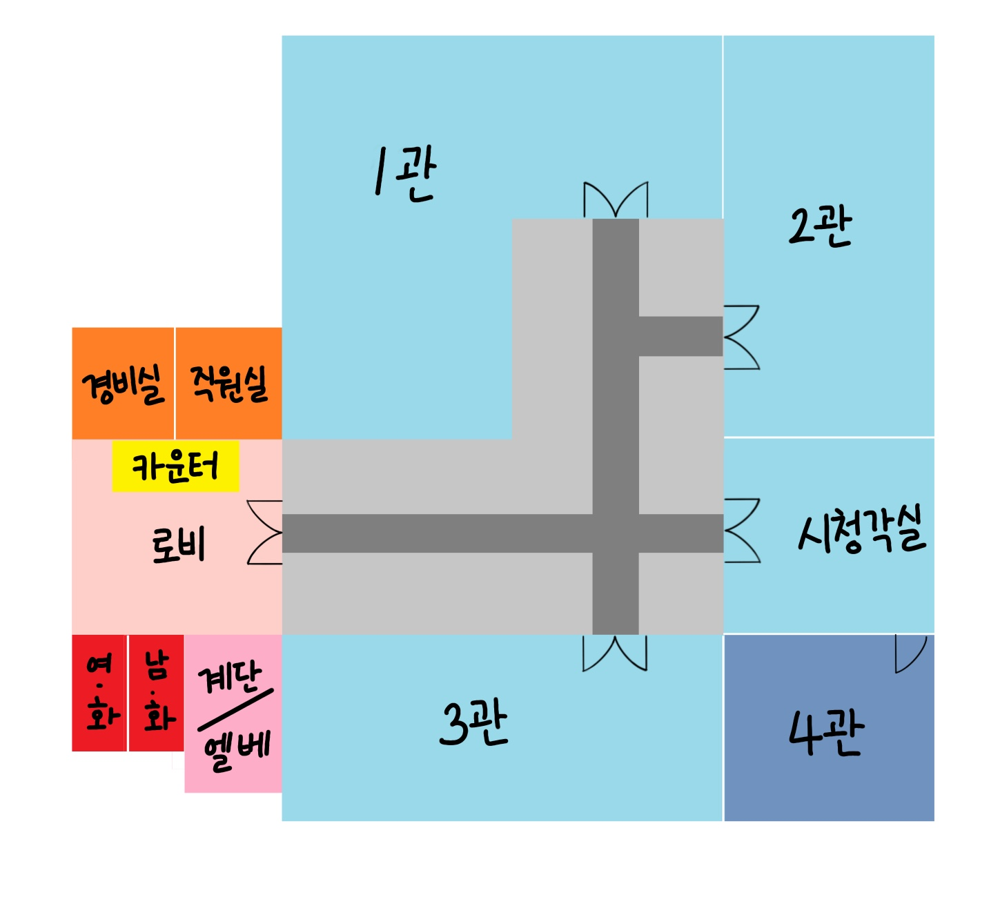

# 회의 : 레벨디자인

---

일단 방 복잡도, 이런건 다 배제.

필요한 오브젝트만 설치

### 로비

---

중요 오브젝트 : 카운터

처음 플레이어가 마주하게 될 곳

카운터가 될 데스크 말고는 다른 오브젝트는 존재하지 않음

### 경비실

---

경비실과 직원실의 차이?

### 화장실

---

### 계단 / 엘리베이터

---

### 복도(메인홀)

---

역 니은자 방식

문을 기준으로 트레일이 달려있음

약간의 현실감을 위해 비상구 위치 표시? 가 있으면 좋아보임(중요성 낮음)

복도에서는 **이상현상 인카운터 없음**

### 제 1관 (고대관)

---

[@도편추방제]([도편추방제](https://github.com/DEU-GameProject-Developers/Conversations/master/%EA%B8%B0%ED%9A%8D/%ED%9A%8C%EC%9D%98%20%EA%B0%81%20%EC%84%B9%EC%85%98%20%EB%B3%84%20%EC%9D%B4%EC%83%81%ED%98%84%EC%83%81.md#L145)) 부터 참조

필수 오브젝트 :  **도자기, 메두사 조각상**, 컴퓨터, 전화기

역 기억자 모양

1. 입구
2. 컴퓨터
3. 관내 핫라인(전화기)
4. 도자기
5. 메두사

추가 장식 오브젝트 :  스파르타(무기, 장식품) / 올림푸스 조각상 / 고대 그리스에 사용된 도구(칼, 도끼 등) / 고대 벽화 

### 제 2관

---

필요 오브젝트  :  전화기, 컴퓨터, 마녀 사냥 그림, 갑옷(3개), 스테인드 글라스

1. 출입구
2. 전화기
3. 컴퓨터
4. 갑옷
5. 마녀사냥 그림

추가 장식 오브젝트 :  기둥, 가벽, 조명(실제 빛 X)

### 제 3관 (근대관)

---

필요 오브젝트 :  전화기, 컴퓨터, 샹들리에, 국기, 설명 

추가 장식 오브젝트 :  가벽, 책상

### 참고

---

제 나름대로 간단하게 그려봤는데 보시고 참고용으로 써주세욤